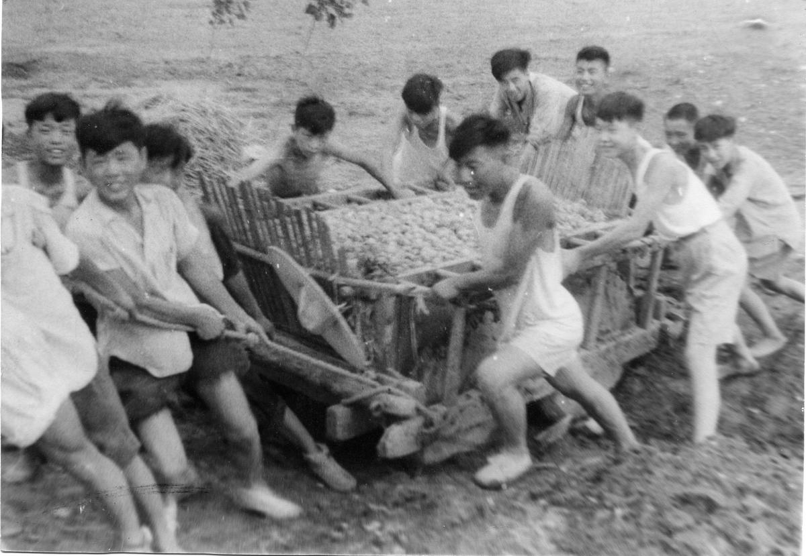
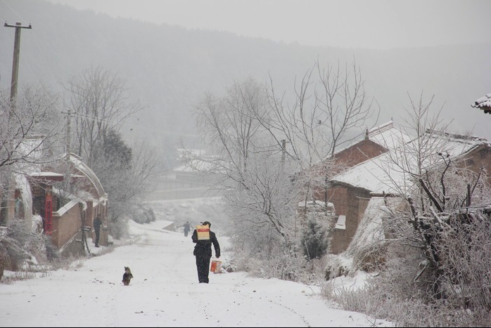

# 漫长的纪念

以前每年过年，爷爷总是一个人，坐着小板凳在门前闭目沉思。

稚幼之年，总是听爷爷讲他少年时代的故事。爷爷是一个典型的知识青年，谈三国评历史，还写得一手好字，然而，因为文革的到来，导致了生活的一落千丈。因为是地主的儿子，学习优异，却必须放弃。

奶奶说，文革后，生活所迫，爷爷年轻时连打带扛了十几年的红砖，结婚时的婚房，亦是那些手工砖一块一块砌起来的。我很难想象，一个内心洋溢着知识抱负的年轻人，突然被迫走向无止境的体力劳动时的心理落差。

关于那个年代的爱情，奶奶说，1967年，在一个秋收季节，熙熙攘攘的人们正劳作在金黄色的稻田之中，吮吸着金甜色的稻香， 奶奶只是看了爷爷一眼。奶奶说，那时的爷爷很帅气很阳光。时代从未变过的，原来就是"脸还是很重要"。

另外值得一提的是，爷爷的父亲的亲哥哥，即是爷爷的伯父，是战争年代国民党的某团团长，国共内战的结束，导致了两个家族的两岸分离。我记得小时候拆开过台湾爷爷的信笺，那和爷爷的字一样好看。直到现在，信封上的那个“啟”字都让我记忆深刻。不知是不是这样的经历，让我直到现在，还会坚持手写信。

另一个记忆犹新的，就是爷爷还能做得一手好菜，整个亲戚圈里，貌似只有爷爷能算得上一个大厨子。那年村里的红白喜事，几乎都会请爷爷去做主厨。在我还喜欢去田里放野火埋春雷的小屁孩年代，尝过了无数爷爷的菜肴，而懂事以后，我却再也记不起那种味道。

随着我渐渐长大，爷爷也渐渐老去，我也没再尝到爷爷的厨师级别的菜，没再看到爷爷写的字。随之而来的，是爷爷身体的恶化和言语的渐少。是两年前，爷爷被查出肺癌，接着胃出血，生活的继续已然必须依靠药物的摄入……

然后，在宜昌实习的某一个清晨，突然得到了爷爷去世的噩耗……

奶奶说，那天凌晨，爷爷似乎是意识到什么，叫来了自己的儿子，换上了一身新装，然后安详地闭上了眼睛。

爷爷，就这样离开了，吗？直到现在，我还是难以相信。

又是一个新年，今年的雪，下得比往年的大，比往年的白，而我，还能记起十年前住在那个您砌起来的瓦房里，那一天漫天飘雪，您穿着雨靴，扛着扁担篓篮，走在门前那条漫长的小道上……

天堂路上，请您一路走好。
